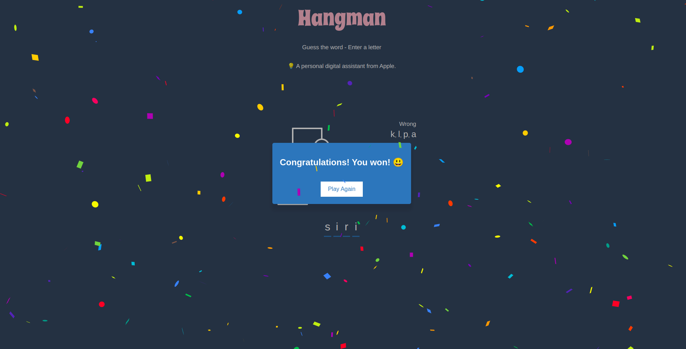
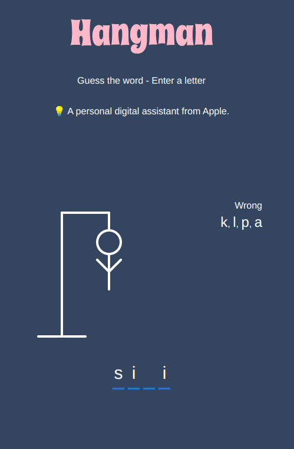

# React Hangman Game
This is a simple Hangman game built using React. It provides an interactive interface for users to guess words and try to solve the puzzle.

## Preview





## Features
Interactive Gameplay: Users can input letters to guess the hidden word.
Visual Feedback: Display of guessed letters, remaining attempts, and the progress of the word.
Win/Lose Conditions: The game ends when the user either successfully guesses the word or runs out of attempts.
Customizable Word List: Easily modify the list of words for users to guess.

## Installation
To run the Hangman game locally, follow these steps:

Clone this repository to your local machine.


```bash
git clone https://github.com/your-username/react-hangman-game.git
```
Navigate to the project directory.


```bash
cd react-hangman-game
```

Install dependencies using npm or yarn.

```bash
npm install 
```

Start the development server.

```bash
npm start
```
Open your web browser and go to <http://localhost:3000> to play the game.

## Usage
Enter letters from the keyboard to guess the hidden word.
Each incorrect guess will decrease the remaining attempts.
Successfully guessing the word within the allotted attempts will result in a win.


